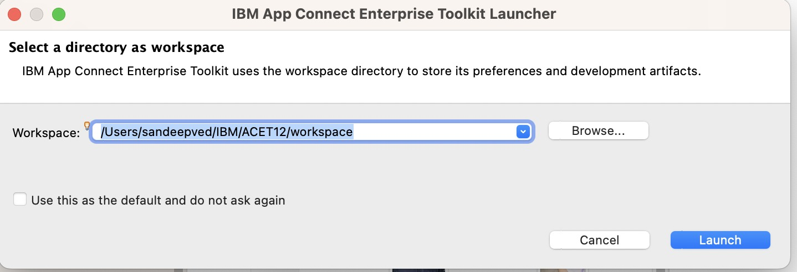
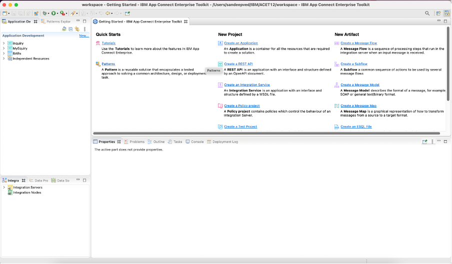

# Prepare Client Tools

- [IBM App Connect Enterprise (ACE) Toolkit Setup](#_Toc105518921)
- [Openshift Command Line Interface (CLI) Setup](#_Toc105518922)
- [Mailtrap SMTP Setup](#_Toc105518923)

## IBM App Connect Enterprise (ACE) Toolkit Setup

Install IBM App Connect Enterprise for developers (also called ACE).
Make sure to select the correct download package for your OS (Windows,
Linux, Mac).

Click on **Download** button on the following
link: [<u>https://www.ibm.com/docs/en/app-connect/12.0?topic=enterprise-download-ace-developer-edition-get-started</u>](https://www.ibm.com/docs/en/app-connect/12.0?topic=enterprise-download-ace-developer-edition-get-started)

The version used in this practicum is 12.0.8

Complete the installation through the installer package you just downloaded for your OS. 
eg: 12.0.8.0-ACE-MAC64-DEVELOPER-UNSIGNED. You can use the IBM ACE Installation page as a guide to complete the installation.

Once installed, open the installed ACE toolkit. A view similar to the screenshot below will launch.

[Return to Scenario Build page](README.md)

## Openshift Command Line Interface (CLI) Setup

Download Openshift Command line tools (OC Client)

Download OC Client for your platform

Place downloaded oc binary file (oc or oc.exe )to the path in variable for your platform. 

Alternate URL Reference: https://mirror.openshift.com/pub/openshift-v4/x86_64/clients/ocp/stable-4.10/

See the below URL for more details.

https://docs.openshift.com/container-platform/4.10/cli_reference/openshift_cli/getting-started-cli.html 

[Return to Scenario Build page](README.md)

## Mailtrap SMTP Setup

Signup for a SMTP account on mailtrap.io. Once logged in, note down your SMTP connection settings. For Example,

&nbsp;&nbsp;&nbsp;&nbsp;<u> <i> Host: smtp.mailtrap.io </i> </u>

&nbsp;&nbsp;&nbsp;&nbsp;<u> <i> Port: 2525 </i> </u>

&nbsp;&nbsp;&nbsp;&nbsp;<u> <i> User: 2ef08bdc18285b </i> </u>

&nbsp;&nbsp;&nbsp;&nbsp;<u> <i> Password: 11xxxxxx06b8da </i> </u>

You will also need to check all your emails under MyInbox in mailtrap web site.

[Return to Scenario Build page](README.md)