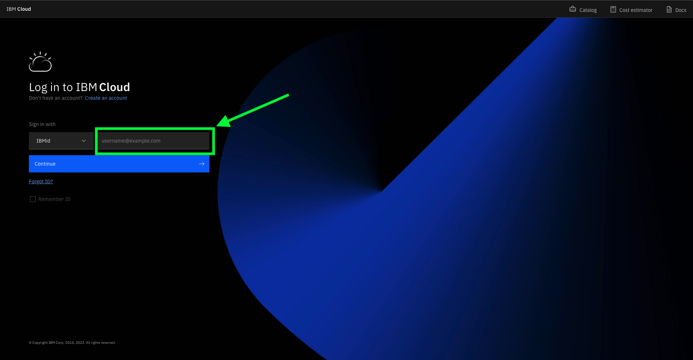
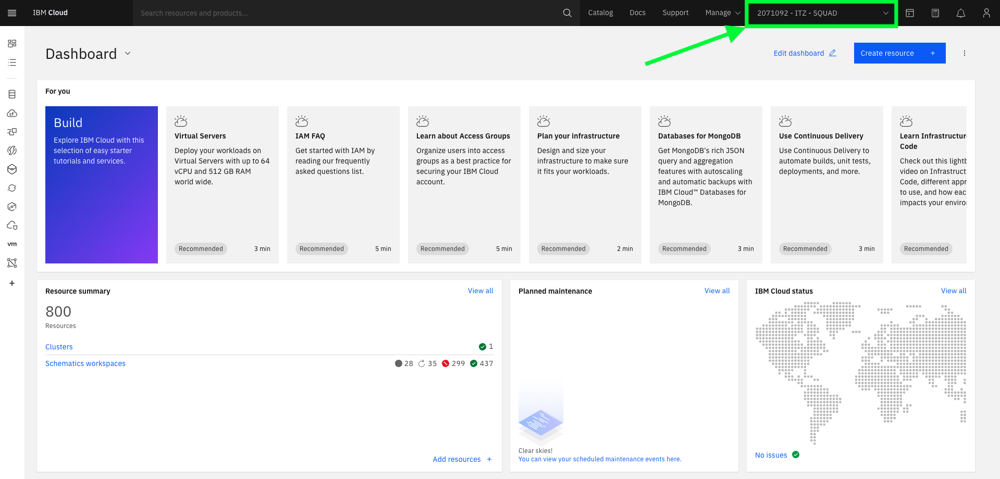

## Install Cloud Pak for Integration on ROKS cluster

1. Login to [IBM Cloud](https://cloud.ibm.com/catalog) with your IBM account credentials.

2. Confirm that you are using the **ITZ** account.

3. Click **Create resource +** to access catalog

4. From the Catalog, select **Cloud Pak for Integration**

5. On **_Select a deployment method_**, go ahead and select the version of Cloud Pak for Integration that you want/need to install. Some demos are ready for a specific version of Pak, please check in the demo page what the version is necessary.

6. Scroll down the page, and you should see the **_Select your cluster section_**. Select the Redhat Openshift Cluster that you just created from the list.

7. Click **Add project** Enter a project name, and a tag name to identify your cluster.

8. Enter **CP4I** as Project name and click **Add**.

9. Scroll down. On Set the deployment values section. Unmark the **Use an existing secret?** to define a new password and enter a value for csDefaultAdminPassword. It is important that you choose a password that is 32 characters in length and it conforms to the password rule **_(Alpha numeric)_**

* *Note* *: Currently password validation is not enforced on this page. If you proceed with an invalid password you will be able to start the installation but it will fail. There is no way to recover from this error other than provisioning a new cluster.

10. Scroll down to see **_'Parameters with default values'_** and click on the **_'twisty'_** to open them. There is no need to change the default values except for the parameters that start with demo.

If you do not have an SMTP email server and accounts that you can use, you may sign up for a free mailtrap.io account using https://mailtrap.io. Mailtrap.io is a free cloud service that mimics an SMTP server. It is used for development/demonstration purposes only.

Fill in the following fields if present/applicable:

demoPreparation: Set to * *'true'* * 

demoAPICEmailAddress: If you’re using mailtrap.io, use any email address. Use * *'apicadmin@example.com'* * to be safe — example.com is guaranteed to not be a real domain. If you’re using your own mail server, use an email address that you can receive and read.

demoAPICMailServerPort: If you’re using mailtrap, leave this as 2525

demoAPICMialServerUsername: Set this to your mailtrap username.

demoAPICMailServerPassword: Set this to your mailtrap password.

11. Accept the license agreement and click **Install** to install Cloud Pak for Integration. The installation will take up to 90 minutes.

12. You can view the progress in the Schematics progress bar or check the details in view log.

13. When you see the **Active** status, you will be able to access Cloud Pak for Integration Platform Navigator by selecting **Offering Dashboard** on the upper right corner of the page.

You can also get to the platform navigator page from a browser by manually entering **cpd-cp4i.<yourcluster-domain-name>**. Your cluster domain is shown in the Details section in Reserved Instances.

14. On the **Log in** page, select the authentication type **IBM provided credentials (admin only)**.

15. Log in with your **admin** user and password.

16. Click on **View capabilities**.

17. Here you are able to view the instances for API Connect, App Connect Designer, App Connect Dashboard and Asset Repository. Additional instances for any of the Integration Capabilities can be created by selecting **Create capabilities**.

You have successfully completed cluster provisioning, Cloud Pak for Integration installation and deployment of API Connect and App Connect. You are ready to proceed to CP4I Labs that are supported on Cloud Pak for Integration on ROKS.

[Go back to Environment Setup](/Environment/README.md)