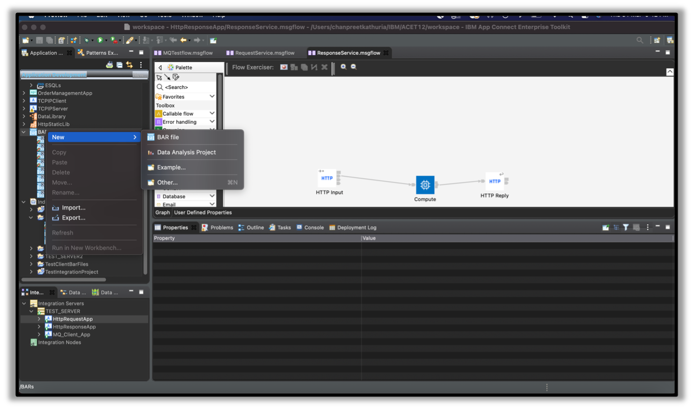
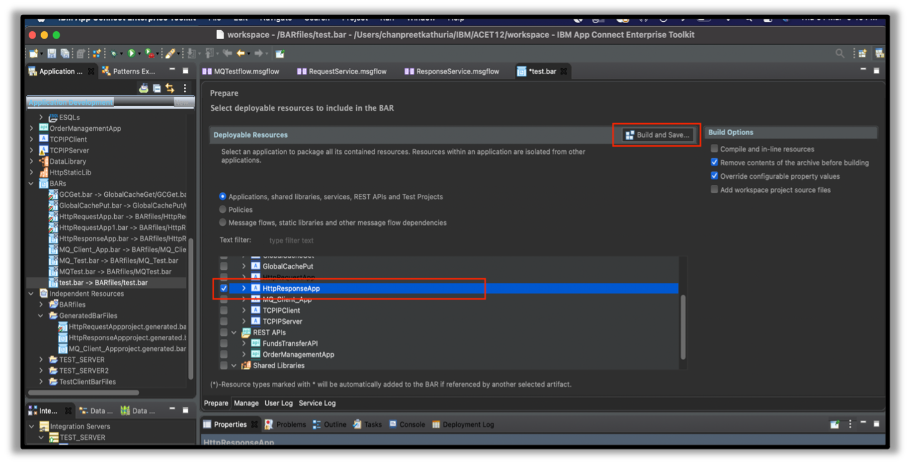
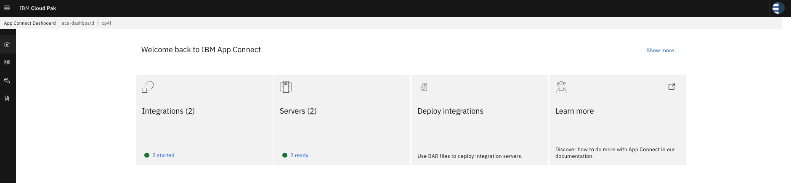
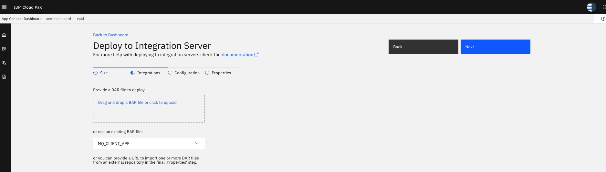
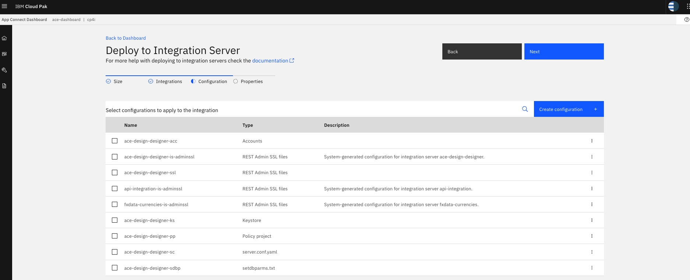

## Build ACE message flow into BAR file

1. To generate BAR file for the assets. Select BAR --> New --> BAR File 
   Add a name (**HttpResponseApp** or **HttpRequestApp** or **MQ_CLIENT_APP**) for the BAR file and click    Finish.

2. Select resources to include in the BAR file (**HttpResponseApp** or **HttpRequestApp** or **MQ_CLIENT_APP**), then click on “Build and Save” to generate BAR file. 

3. Once Build, the BAR file will appear under BARs on the left side of Application Development panel. 

4. Repeat above **step 1** to **step 3** to create BAR file for **HttpRequestApp** and **MQ_CLIENT_APP**

[Back to Main Page](README.md#topic-6--refactor-build-and-deployment)

&nbsp;
## Deploy BAR file to CP4I Integration Servers
 
 1. Navigate to IBM Cloud Pak for Integrations home page. Select Run --> Integrations --> It will redirect you to IBM APP Connect

 
 2. Click on "Deploy Integrations" to create new Integration Server to deploy BAR file.
 For MQ --> Select QuickStart tool kit integration --> Hit Next

 
 3. Provide the BAR file to be deployed to the server and hit next. Bar file can be directly dragged and dropped onto CP4I browser console.
 **Create one integration server for each of the bar file: HttpResponseApp or HttpRequestApp or MQ_CLIENT_APP**

 
 4a. For HttpResponseApp or HttpRequestApp, just click **Next**. For MQ_CLIENT_APP, Skip any Configuration to be applied this integration if you have not created a MQ Policy Project and click **Next**.  

If you have one or more MQ Policy Project corresponding to each MQ environment, then you can create and select configuration for each MQ Policy Project, select it and Click **Next**. Click **[here](Create-MQ-Policy.md#integration-server---mq-policy-project-configuration)** for more details.
 

 
 4b. On the "Common Settings". Validate the settings as shown in the snapshot below. Click Create.
  **Create Give name as per the bar file name, eg HttpResponseApp or HttpRequestApp  or MQ_CLIENT_APP**

 
 5. Wait until the status of the server has changed to "Ready"

 
 6. The status will change to "Ready".

    
[Back to Main Page](README.md#topic-6--refactor-build-and-deployment) 