# FX Data Consumer

## Creating REST API in ACE (App Connect Enterprise) Toolkit

In this section, we will be using the ACE Toolkit to create a REST API. You may need to **[install client tools](SolutionBuild/Kafka-Pre-lab/Install-Client-Tools.md)** to work on this lab.  
For more info, see [here](https://www.ibm.com/docs/en/app-connect/11.0.0?topic=sh-how-can-i-try-out-app-connect-enterprise)

Once you have downloaded the ACE Toolkit, get acquainted and comfortable with the interface. Now, let's create a new REST API. Simply click on **File**, followed by **New**, and select **Rest API**.  

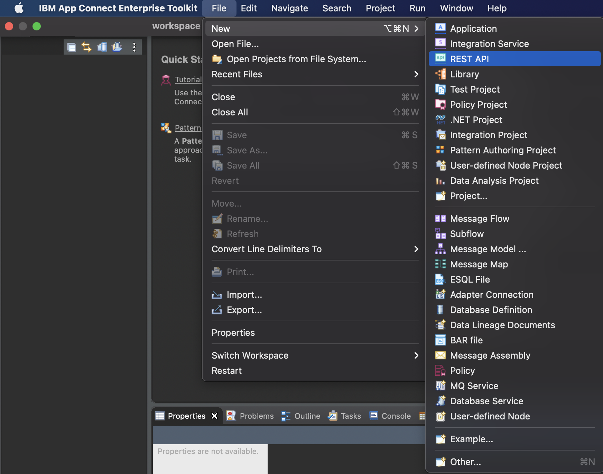

A pop-up window will appear where you are required to enter the name of the REST API. Do note that you cannot have two projects with the same name in the same workspace so ensure that the name is unique. Click **Finish**.

Once the REST API is created, you will see the below screen. Now, we have to work on the **OpenAPI Editor**. Click on the hyperlink  **"Edit API Document in OpenAPI editor"** that will open up another window OpenAPI Editor. You may have to click on another new App icon (ibmtkelectronapp.app) getting launched in the popup and Click **Allow**.

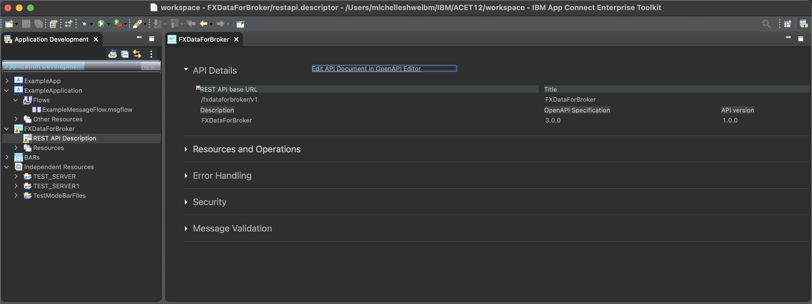

Now, once the above screen appears, we can begin working on our **OpenAPI Editor**. 

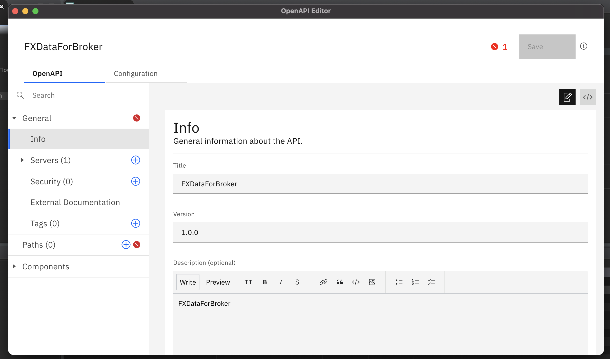

Firstly, we will have to define the schemas. In our `Currency` schema of type object, we have defined the properties: symbol, request-dt, open, close, low and high. 

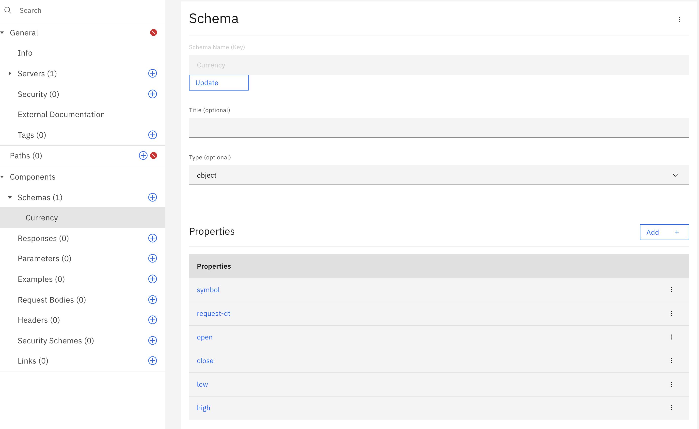

This relates to the currencies whereby

1) symbol is the symbol of the currency (USD, SGD, CAD etc.) Type **string**  
2) request-dt is the date and time of the request. Type **string**  
3) open is the opening currency rate for the day. Type **number**   
4) close is the closing currency rate for the day. Type **number**  
5) low is the lowest currency rate for the day. Type **number**  
6) high is the highest currency rate for the day. Type **number**   

Our `Currencies` schema is simply of type **array** with 0 min. length. This is to store the currency queries. 

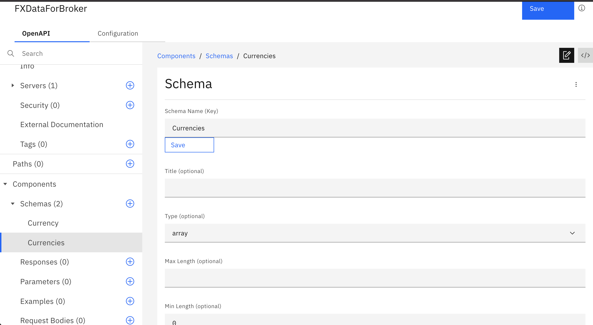

Our aim is to create four currencies as seen in the screenshot above. `Currency` (object), `Currencies` (array), `symbol` (string) and `request-dt` (string) 

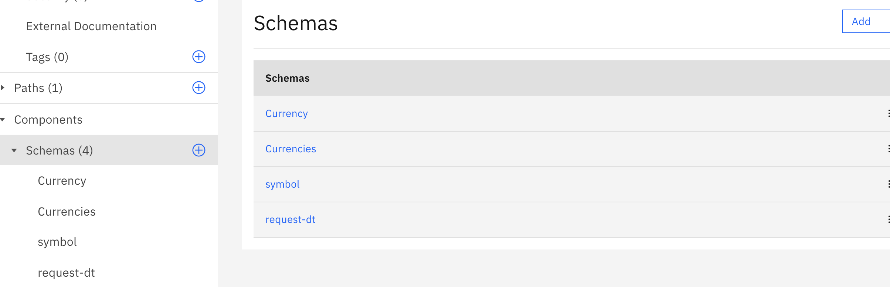

Now, let's work on the `path` to link our schemas together. In this example, we have named our path `broker-currency`

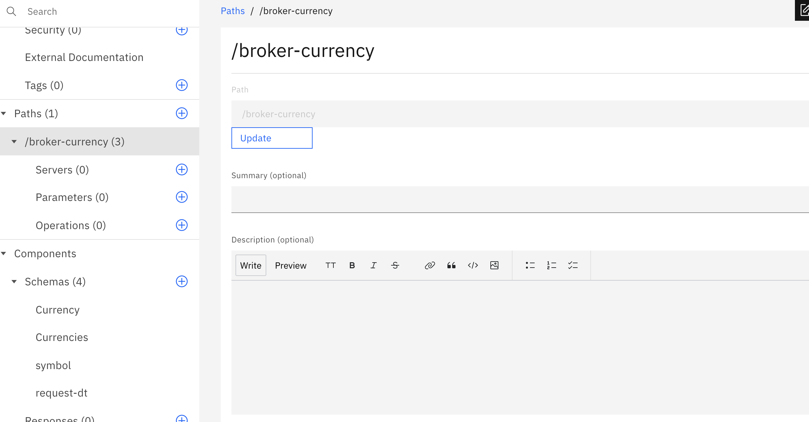

The first step is to define the operations. Here, we need a `GET` operation. So let's create that and fill it up as we go along. 

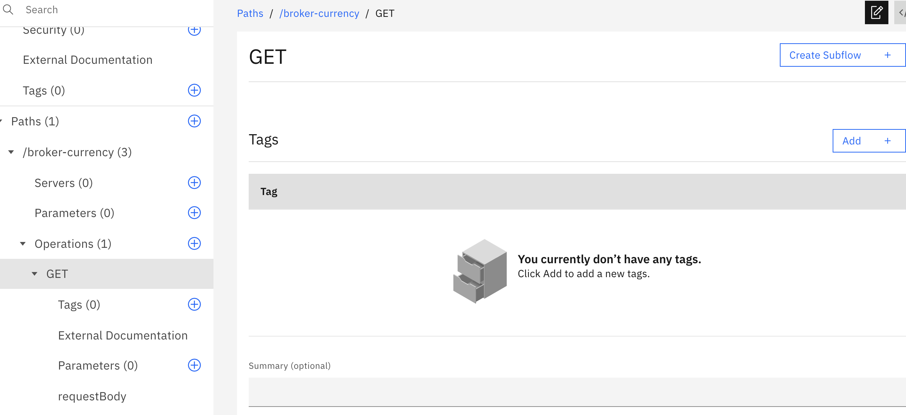

First, our parameter will be the `request-dt` schema that we defined in the previous steps. Link it to the parameter in this `GET` operation. Select the Required checkbox.

Also uder the Schema option, click Create to Reference to an existin schema - "request-dt".

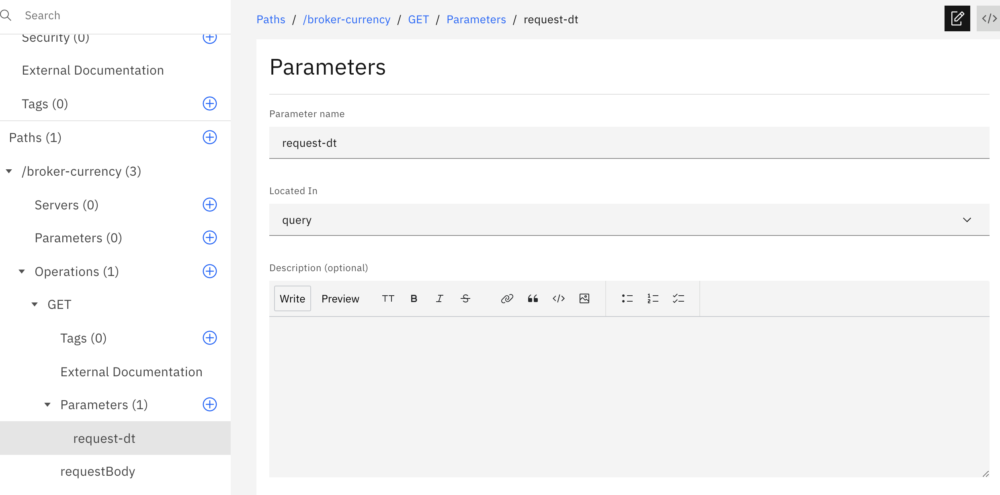

In the responses section, we will select `200`. This is a standard response code for successful HTTP requests. 

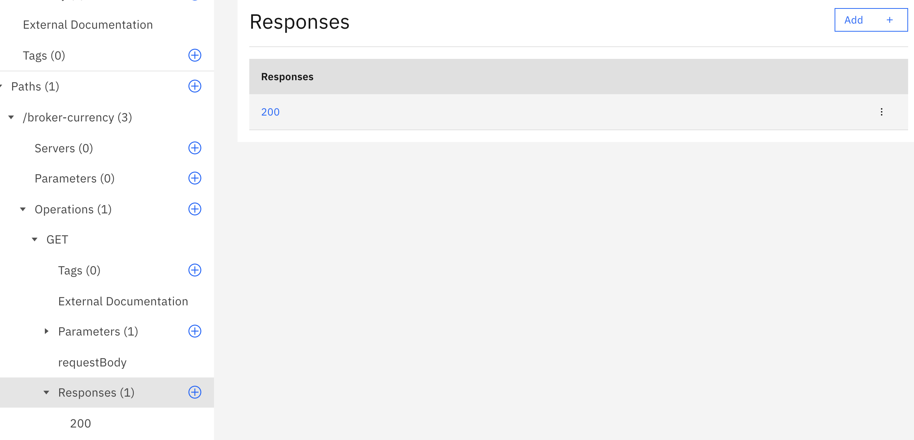

Scroll down to the `Content` portion where we will add a `application/json` file.

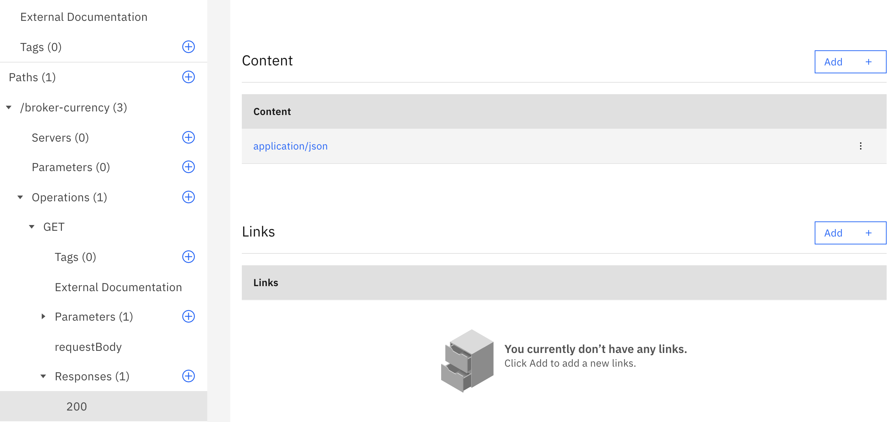

Within this `application/json` file, simply link it to the `Currencies` schema which we defined earlier. Under Schema, Click Create button. Then select Reference option and select existing Currencies Schema in the popup and Click Create.

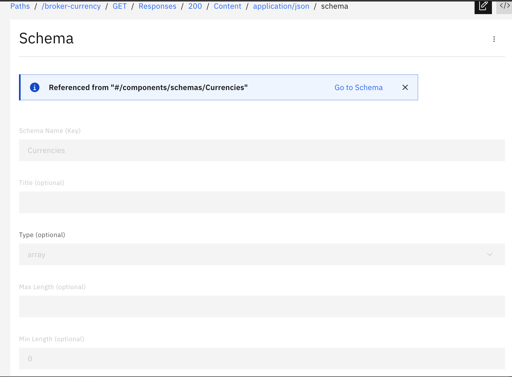

There should not be any error. Click Save button to Save the configuration.

Close the OpenAPI Editor.

Now Under the REST API Description. You should be able to Create a SunFlow to Implement the Get Operation.

### [Go Back](../README.md/#solution-build)