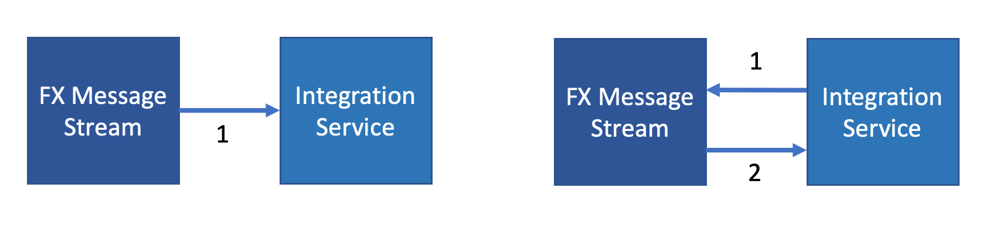
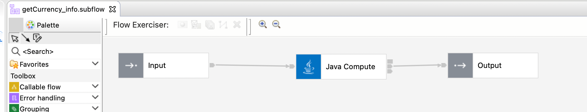
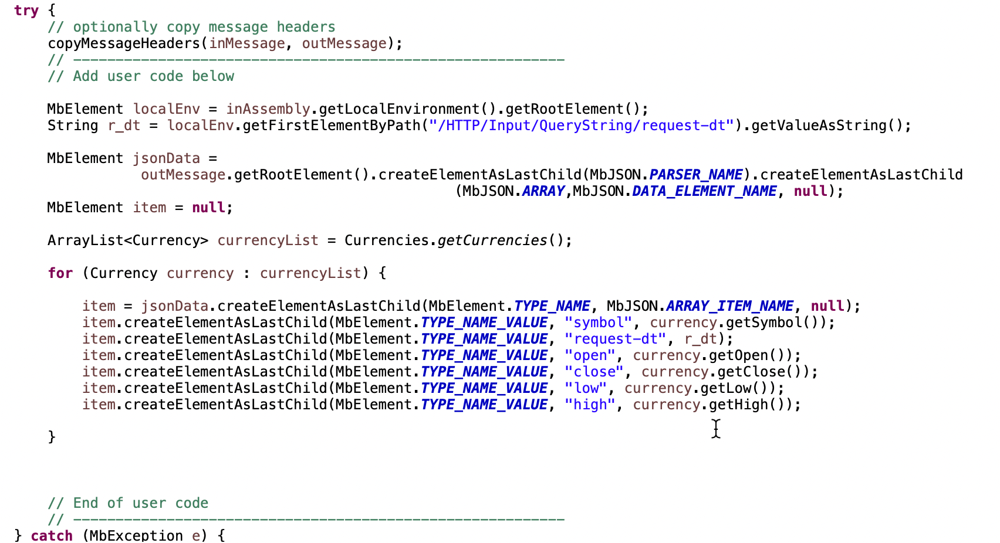
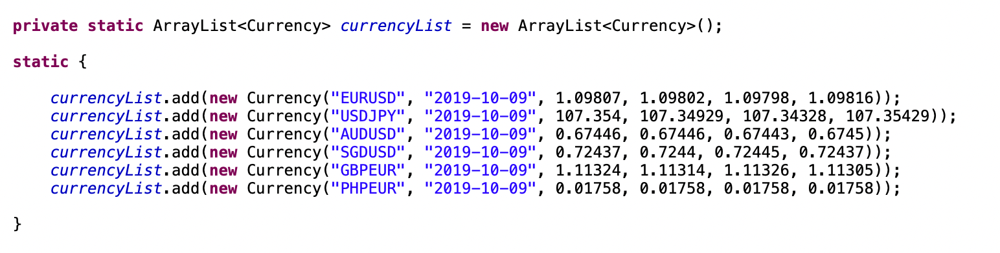
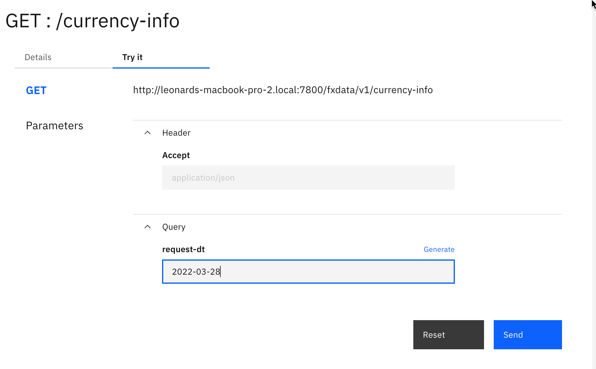
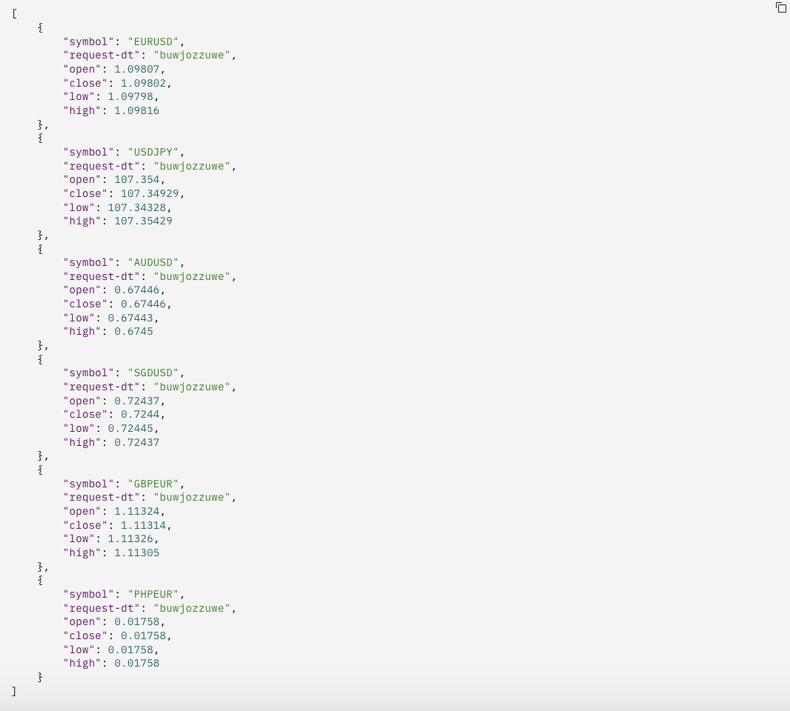

# Integration Interfaces 
A student in this practicum you may the scenario has loosely defined the interaction but has not explicitly defined the integration models.

So you will need to make some assumptions about how this interaction may work. In the case of the FX Mesage Stream there are two possible message interaction models.

1. A push model where the FX Stream is pushed to the customer and 
2. A pull model where the customer system calls to the FX stream provider for data.

As you asses the and plan the interaction models you will need to consider and make decsions for the the following
1. Communication interration mode synchronous/asynchronous
2. Communication transport HTTP/MQ ...
3. Preferred data message format JSON/XML ...
4. Frequency of interaction.

For those that want to focus their integration energies in other parts of the practicum we will now outline a predefined integration model with a predefined interface

## Building the Interface

Rfer to the procedure in [Using IBM REST API to Create FXData Interaface](../RestAPI/RestAPI.md) to create the external FXData Interface as per your needs. 

Alternatively you can use the sample project interchange file [FXData.zip](../../scenario1/Scenario/fx-assets/FXData.zip) provided here which can be customized as required. Details of this sample project interchange file is given below.

## Predefined Interface

For this predefined integration model we assumed the following:

- The service will be initated from the customer to the FX provider using a REST call to the FX Provider this will be executed daily.

- The FX Provider will respond with the list of currencies. The data structure of the response will consist of the a list of Currency each list item including the currency symbol, the request date, the opening rate, closing rate, daily high and daily low.

- The service definition is defined here
[FXData YAML](../../scenario1/Scenario/fx-assets/FXData-1.0.0.yaml)

  This sample file creates a standard response that substitutes the request date. The practicum squad can use this to get started and expand on the capabaility to be more elaborate if they choose to.    
 

  In this sample project file, the jave Compute Node contains the logic for creating the default list and substituting the date    

  In this sample project file, the currency list is predefined in the Currencies.java class    

### Example Input
The service is defined to accept a single http query parameter called reques-dt.

### Example Output

## Setting Up Predefined FX Data

To utilize the FXData flow as a quick start to simulate the data provider.

1. Import the [FXData.zip](../../scenario1/Scenario/fx-assets/FXData.zip) to ACE Toolkit. Right click on Projects list and select Import.  
1a. Select Project Interchange file and click Next.  
1b. Browse the above sample zip file and click Finish.  
1c. Review and modify it if needed.  

2. Create a Bar File.  
2a. Under the Project, Right Click and select New -> BAR file. Just Enter the Name and Click Finish.  
2c. Under the new BAR Prepare Window, Select the Sample REST API application that need to be included in the BAR File.  
2c. Click on **Build and Save** to save the bar file.  
2d. Under the BARs folder, you can see the project BAR file. Right Click on the BAR file and click proeperties. Note the physical location for the BAR file to be deployed to Integration Server.  

3. Create a Integration server in FX Data project.  
3a. Login to CP4I Admin Console and Go to Menu -> Run -> Integration. Click on Integrations. 
3b. Create a new deployment by clicking on Deploy Integrations+. 
3c. Select Quick Start Integration. Click Next. 
3d. Browse or Drag & Drop the BAR file here. Click Next. 
3e. Just Click Next on the configuration window. 
3f. Enter the Integration Server Name starting with your name to make it unique. Select License LI and License use parameter if needed. Click Create. 
3g. The new deployment integration server will be in Pending Stage. Wait for some time until it become in Ready State. 

4. Test exposed integration.  
4a. Click on your newly deployed integration server for fxcurrency.  
4b. Click on the API object.  
4c. Under the documentation tab, click on overview -> GET &lt;/url>.  
4d. Note the API Details and URL.  
4e. Click On Try It Tab.  
4f. Under the Query -> request-dt parameter, click on Generate link to auto generate the input parameter.  
4g. Click on Send button to call API with this parameter.  
4h. You should be able to get the Response 200 OK and body of response will contain the currency conversation rates as we developed in our project.  

[Return to Scenario main page](../README.md)

