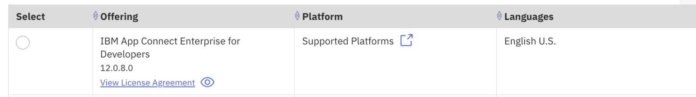
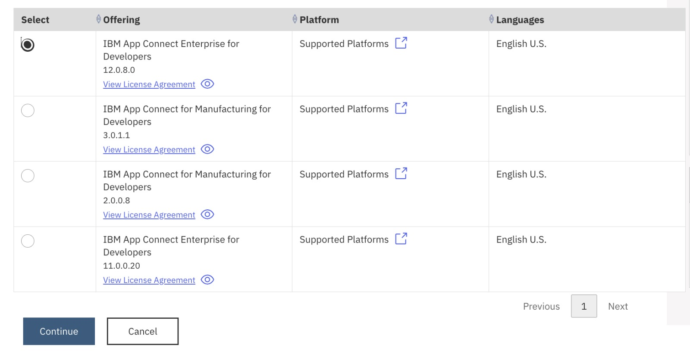
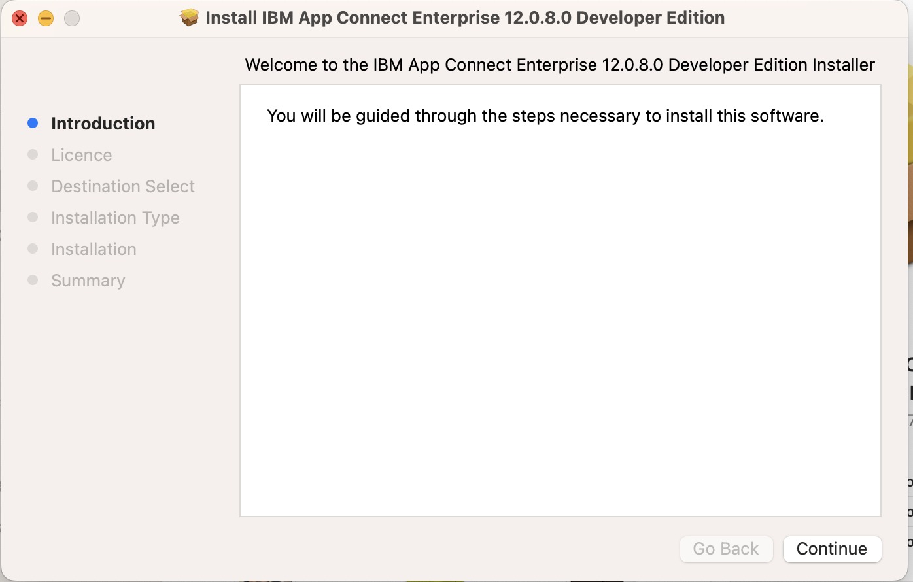
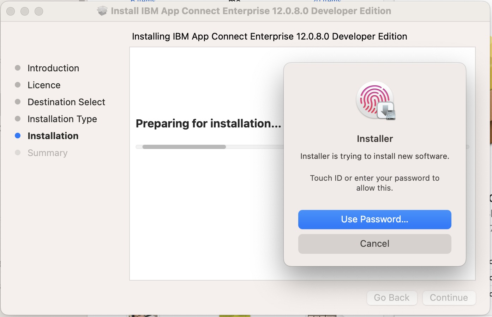

# Prepare Client Tools

- [IBM App Connect Enterprise (ACE) Toolkit Setup](#_Toc105518921)
- [Openshift Command Line Interface (CLI) Setup](#_Toc105518922)

## IBM App Connect Enterprise (ACE) Toolkit Setup

Install IBM App Connect Enterprise for developers (also called ACE).
Make sure to select the correct download package for your OS (Windows,
Linux, Mac).

Click on **Download** button on the following
link: [<u>https://www.ibm.com/docs/en/app-connect/12.0?topic=enterprise-download-ace-developer-edition-get-started</u>](https://www.ibm.com/docs/en/app-connect/12.0?topic=enterprise-download-ace-developer-edition-get-started)

The version used in this practicum is 12.0.8

Complete the installation through the installer package you just
downloaded for your OS. eg: 12.0.8.0-ACE-MAC64-DEVELOPER-UNSIGNED. You
can use the IBM ACE Installation page as a guide to complete the
installation.

Once installed, open the installed ACE toolkit. A view similar to the
screenshot below will launch.

## Openshift Command Line Interface (CLI) Setup

Download Openshift Command line tools (OC Client)

Download OC Client for your platform

Place downloaded oc binary file (oc or oc.exe )to the path in variable for your platform. See the below URL for more details.

https://docs.openshift.com/container-platform/4.10/cli_reference/openshift_cli/getting-started-cli.html 

Alternate URL Reference: https://mirror.openshift.com/pub/openshift-v4/x86_64/clients/ocp/stable-4.10/

[Return to Scenario main page](../../README.md)