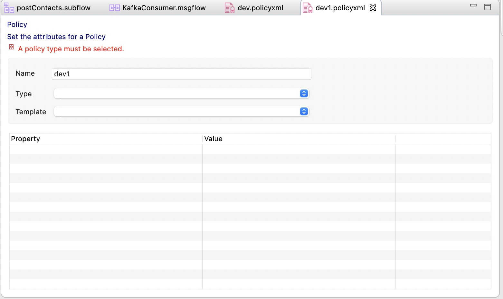
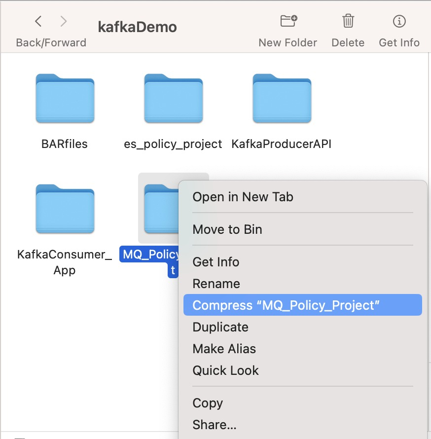
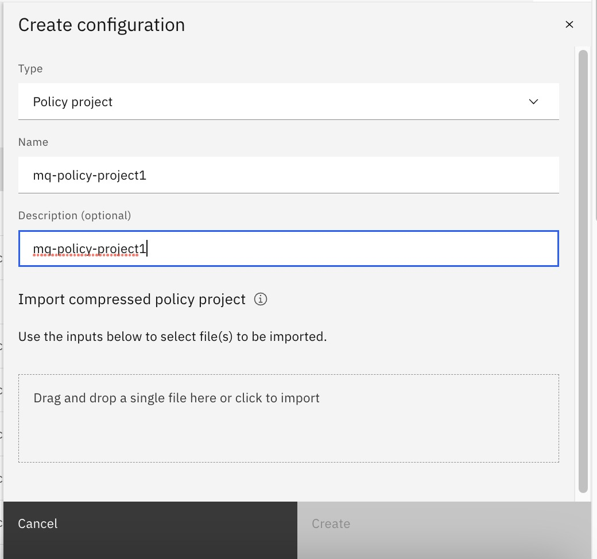

# Create and Export MQ Policy in ACE

## Create MQ Policy

Open the ACE Workbench and choose a workspace where your MQ Flows exists.

In the Projects Area,  Right click and choose New -> Policy.

If you already have a Policy Project, then you can chose it. Otherwise Click **New** to create a new Policy Project.

In the New Policy Creation Wizard, Enter the Name of the Policy and Click Finish.

Under the Policy Project, Enter the name of the Policy. For ex. It could be as per the environment type, eg. dev, uat etc. Click Finish.

Select the Policy Type and Template as **MQ Endpoint**

Enter the MQ Connection Details.

Enter the details as below.

|  Parameter                                | Value 
|-|-
|connection|CLIENT
|destinationQueueManagerName|As per the Queue Manager Name, eg. QUICKSTART
|queueManagerHostname|Name of the MQ Service in OCP Console, eg. quickstart-cp4i-ibm-mq.cp4i.svc.cluster.local
|listenerPortNumber|Port as per the port configured in MQ Service in OCP Console, eg.1414
|channelName|You can enter the default channel, eg. SYSTEM.DEF.SVRCONN
|useSSL|false
|reconnectOption|default

## Export MQ Policy

We need to export the MQ Policy Project as the zip file as below.

Right Click on the policy name, and select properties.

Check the physical path of the policy file. You can open the path from here.

You can see the policy xml. Go one level above to see the Policy Project.

Compress the policy project as the zip file.

Now we should have the policyproject.zip file to be used during deployment in Integration Server.

## Integration Server - MQ Policy Project Configuration

While we deploy the project BAR file in the integration server, after selecting the bar file, you can select an existing or create a new configuration for the policy project.

In the App Connect Dashboard, Configuration Tab, Click on **Create Configuration+** button to create a new configuration.

Enter the Configuration Type as **Policy Project**, name of the policy project configuration, enter the policy project description. Browse or Drag & Drop the Policy Project File. 

Click on the **Create Button** to create this new configuration.

While deploying the project BAR file in the integration server, after selecting the bar file, you can select the configuration for the policy project. Click **Next**.

[Go to Configuration Index](README.md#build-–-bar-file)