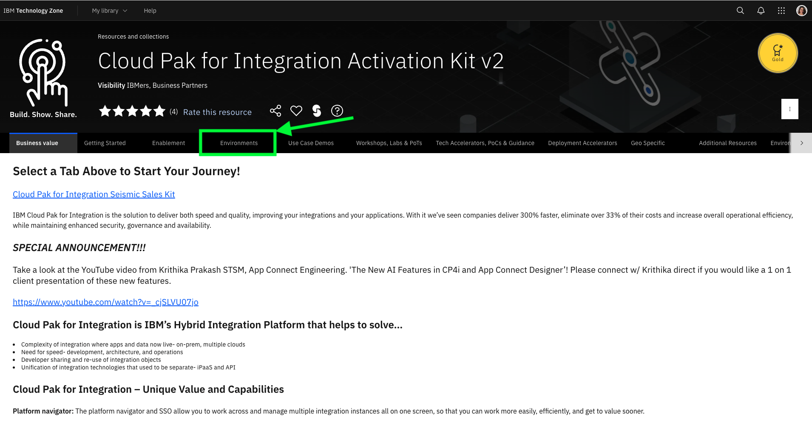
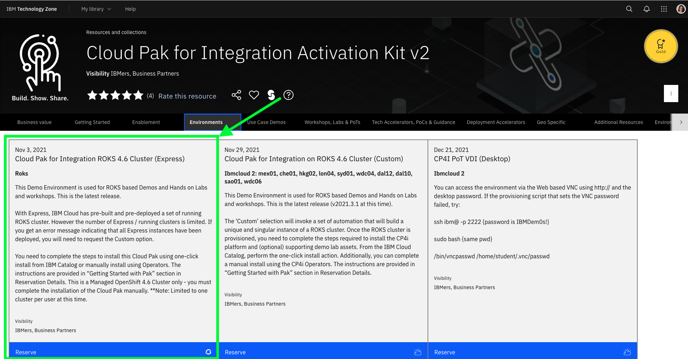

## Create a ROKS cluster in IBM Cloud

Cloud Pak for Integration ROKS cluster can be provisioned from IBMDemos for demo purposes, self-learning or Proof of Concept projects. If you have not already provisioned a cluster, follow these steps.

1. Access the [IBM Tech Zone site](https://techzone.ibm.com/) and log in using your IBM credentials.

2. On the home page, open the Activation Kit tab.

3. Open the Cloud Pak for Integration Activation Kit v2.

4. Open the Environments tab.

5. Select the ROKS cluster you want (the simplest way is to select the latest version of the Express installation).

6. Follow the Create a reservation form to define the details of your ROKS Reservation.

**Note**: If you have any problem in Express installation about No Cluster available, go ahead with the Custom installation (the process is the same; however, Express is a 5-minute request because you will receive a pre-created ROKS cluster from a queue, and custom is 2-hour provisioning because the ROKS cluster will be installed, behind the scenes, from scratch for you).

7. After a few minutes, your ROKS environment is ready. If it is the first time you are requesting a ROKS environment, you will receive an email to accept the invitation to join the ITZ IBM cloud account. Open the email, click Join now and follow the steps to accept the invitation. Your new cluster is available in this ITZ account; take note of the account name. You will use it later to install CP4I.

8. You will also receive an email about the environment status.

Now you are ready to move to the next step and install Cloud Pak for Integration!

[Proceed to Install Cloud Pak for Integration on ROKS Cluster](/Environment/CP4I-on-ROKS/README.md)

[Go back to Environment Setup](/Environment/README.md)