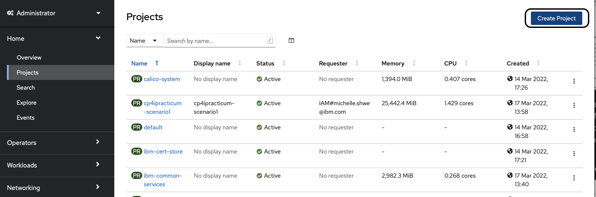
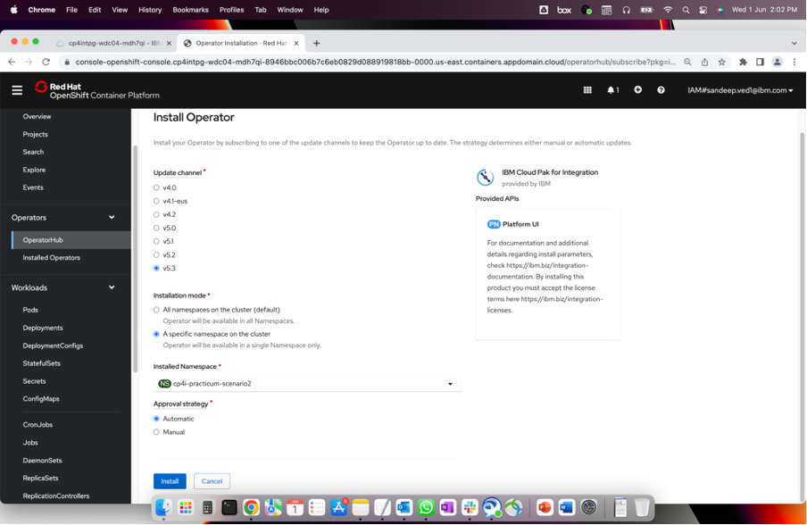
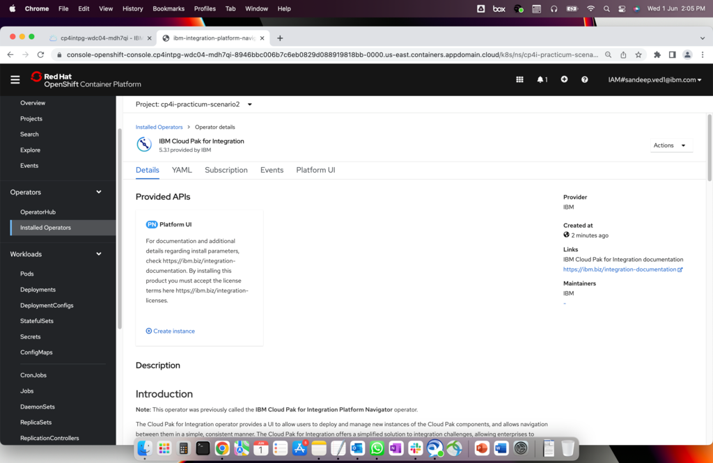
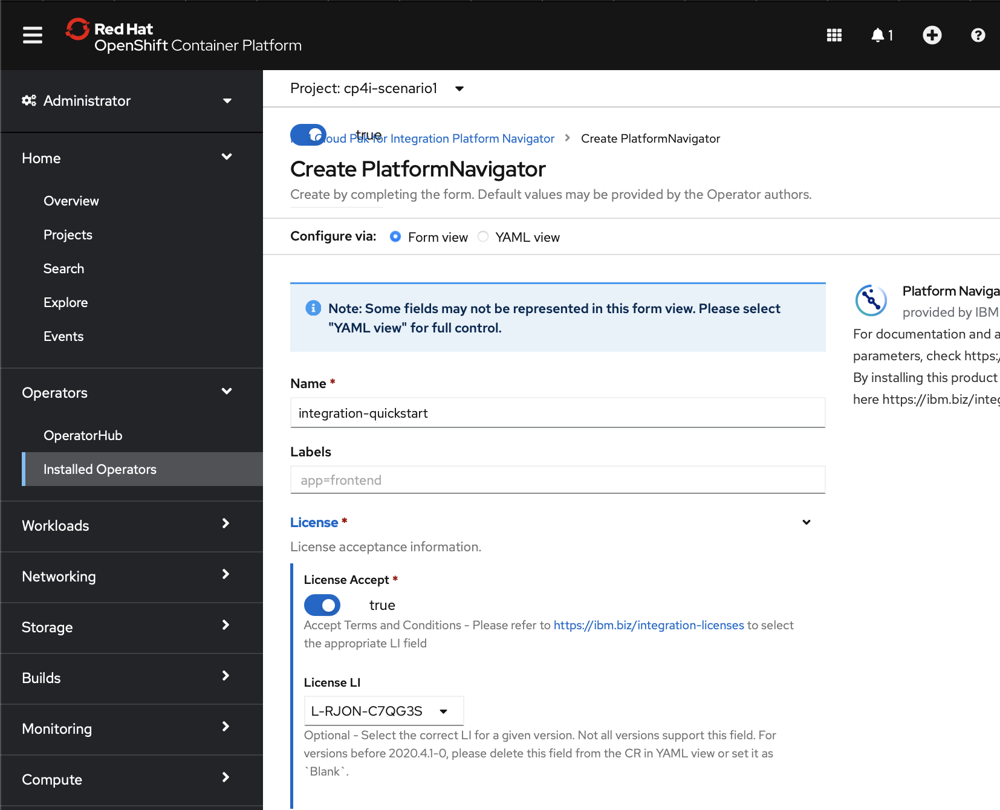
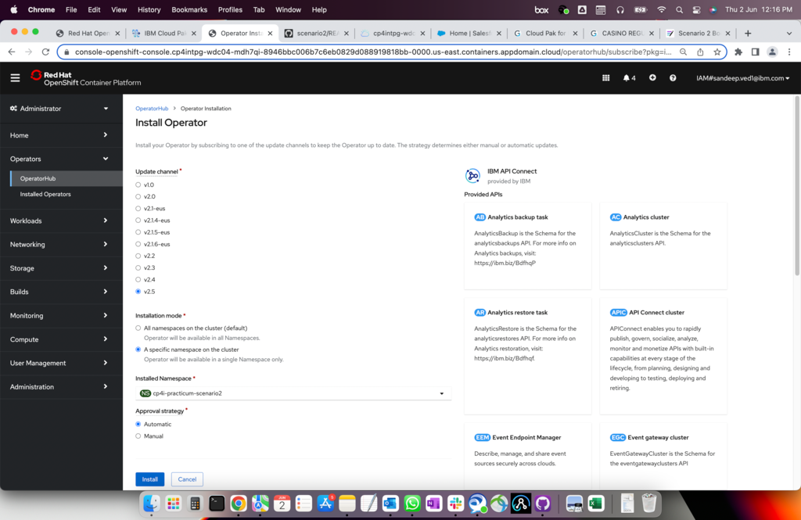

# Installation

### [Topic 5.1: Creating Projects](README.md#creating-projects)
### [Topic 5.2: Add Entitlement Keys](README.md#add-entitlement-keys)
### [Topic 5.3: Install Platform Navigator](README.md#install-platform-navigator)
### [Topic 5.4: Create Instances](README.md#create-instances)

## Creating Projects 

Head to the Red Hat OpenShift Web Console, ensure that you are on Administrator view. Click on "Projects" in the left panel. On the top right hand corner, you will see the button to "Create Project" (encircled in black).

Fill in the details accordingly and hit "Create". 

## Add Entitlement Keys

Firstly, follow the steps [here](https://www.ibm.com/docs/en/cloud-paks/cp-integration/2021.4?topic=installing-applying-your-entitlement-key-online-installation#obtaining-your-entitlement-key) to obtain your entitlement key. After which, you will add the entitlement key you have just obtained to the cluster as a pull secret to deploy Cloud Pak for Integration capabilities. To do so, follow the steps [here](https://www.ibm.com/docs/en/cloud-paks/cp-integration/2021.4?topic=installing-applying-your-entitlement-key-online-installation#applying-pull-secret__web-console).

## Install Platform Navigator

In your OpenShift Web Console, ensure that you are on the Administrator view. Click on "OperatorHub" on the left panel, scroll down until you see "IBM Cloud Pak for Integration Platform Navigator" (encircled in black) and install that. 

Note: This operator was previously called the IBM Cloud Pak for Integration Platform Navigator operator. Now its just called IBM Cloud Pak for Integration.

## Create Instances

Now that we have installed the Platform Navigator, we can create an Instance of it. Click on Installed Operators on the left panel and scroll down to the Platform Navigator. Click on "Create Instance" (encircled in black). 

This will lead you to the following page:

Fill in the details for License as shown below:

For Storage, choose `ibmc-file-gold-gid` for the storage class:

## Install CP4I Operators

Installing CP4I operators is a two-step process. Firstly, you will follow the steps [here](https://www.ibm.com/docs/en/cloud-paks/cp-integration/2020.2?topic=installation-adding-online-catalog-sources-cluster) to add online catalog sources to a cluster. After completion of that step, you will then install the CP4I Operators by following the step [here](https://www.ibm.com/docs/en/cloud-paks/cp-integration/2020.2?topic=installation). 

If you are new to Operators, follow [this link](https://www.ibm.com/docs/en/openshift?source=https%3A%2F%2Fdocs.openshift.com%2Fcontainer-platform%2F4.4%2Foperators%2Folm-what-operators-are.html&referrer=SSGT7J_20.2%2Finstall%2Finstall.html) to read more about them. 

[Go back to -> Table of Contents](../README.md)

