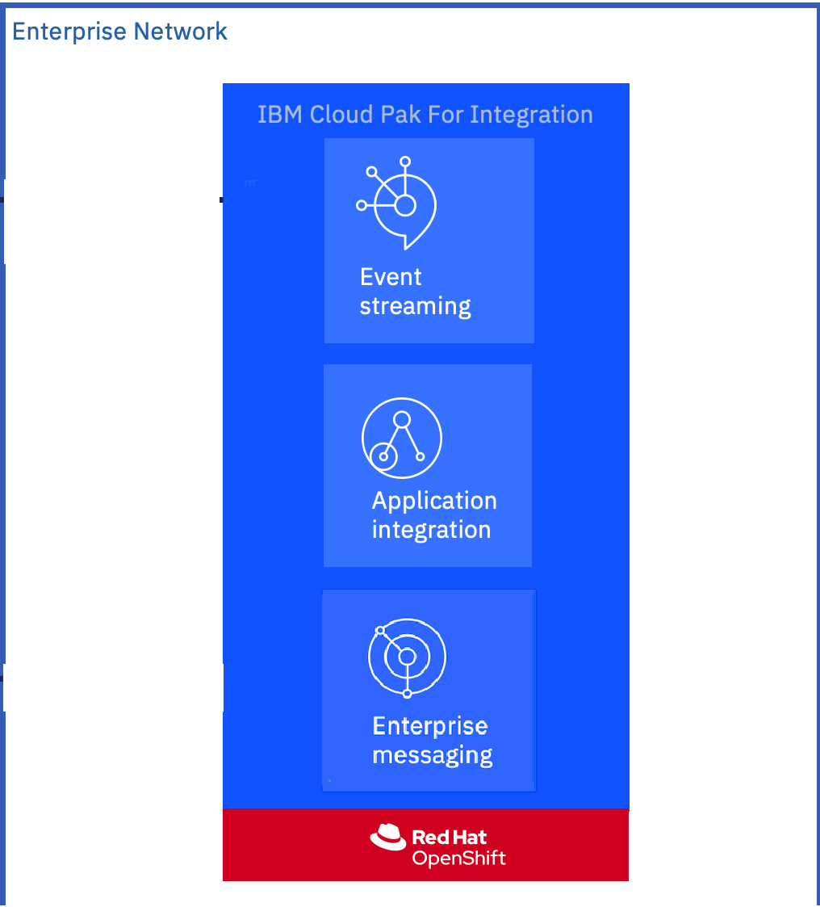
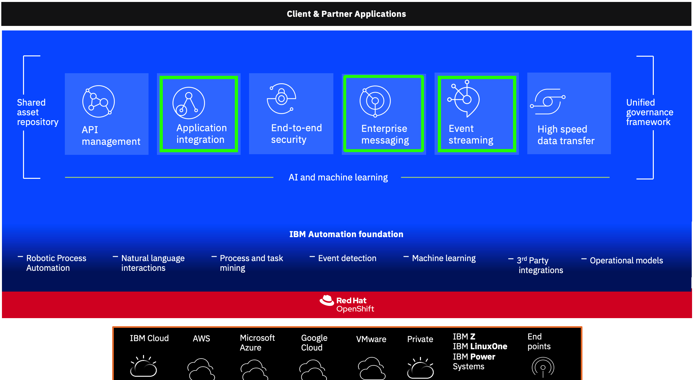

# CP4I Kafka Experience

- **[Scenario Introduction](#introduction)**
- **[Solution Architecture](#architecture)**
- **[High Level Architecture](#architecture_hl)**
- **[Detailed Solution Flow](#architecture_flow)**
- **[List of Software Products Used](#software_list)**
- **[Solution Build](#solution_build)**

## IBM CP4I Scenario Introduction

- FictionCorp is a Online shopping company which recieves the user registration data and stores it in kafka cluster to be consumed by other subscribed applications. 

- They want to use MQ Queue Manager to consume data from kafka topic for to notified downstream applications for new user registrations. 

- They have recently bought CP4I entitelment and exploring to use IBM Event Streams and MQ for implementing above user case. 

**Challanges**  
Your team have (3) days to document your approach to a Solution to the customers business problem using CP4I capabilities and any external capabilities that you think are necessary or useful.
Day 3: Demonstrate your solution to whole class.

## Solution Architecture

### High Level Architecture

- We need an **Application Integration** capabilities for publishing an API to post the user registration data to be produced to **Event Stream** Topic.
- Another application witin **Applicaion Integration** will consume the user registration data and upload it to the IBM MQ Queue.

### Detailed Solution Flow

1. Inside **IBM App Connect Enterprise** there will be an application that will expose the API to post the Data and transform it to the format required by the business users and publish it in an **IBM Event Streams** topic.
2. Second application will be created to consume User data from Topic and upload to he MQ Queue.

### List of Software Products Used In Scenario

The Cloud Pak for Integration services that we will be use are:
- IBM App Connect Enterprise
- IBM Event Streams
- IBM MQ

## Solution Build

This scenario can be implemented/developed using **one of the below two ways**. You can use online **CP4I App Connect Designer** to design the flow and optionally export is as bar file to be deployed it on the integration server. Alternatively you can use traditional **App Connect Enterprise (ACE) Client** to design the flow and export the bar file to be deployed on the integration server.

You can refer to below instructions to **[Create Connection to shared Kafka cluster.](Kafka-Pre-lab/Kafka-Pre-Lab.md)** Steps to create Kafka connection and save credentials and certs for all Kafka labs. 

You may need to **[install client tools](Kafka-Pre-lab/Install-Client-Tools.md)** to work on this lab. 

|  Subject                            | Description                                            |                                                               
|-------------------------|------------------------------------------------------------------------------------------------------------|
| [Using CP4I App Connect Designer](Lab_1/ReadMe.md)       |**Event Driven flows(Kafka)** The purpose of this lab is to provide an introduction to Kafka using **App Connect Designer** Smart connectors to create producers and consumers of Kafka messages using Event Steams 
|-------------------------|------------------------------------------------------------------------------------------------------------|
| [Using IBM App Connect Client ](Lab_2/ReadMe.md)       |**Event Driven flows (Kafka)** The purpose of this lab is to provide an introduction to Kafka Toolkit using **App Connect Enterprise (ACE)** to create producers and consumers of Kafka messages using Event Steams.

[Return to Main page](../README.md)